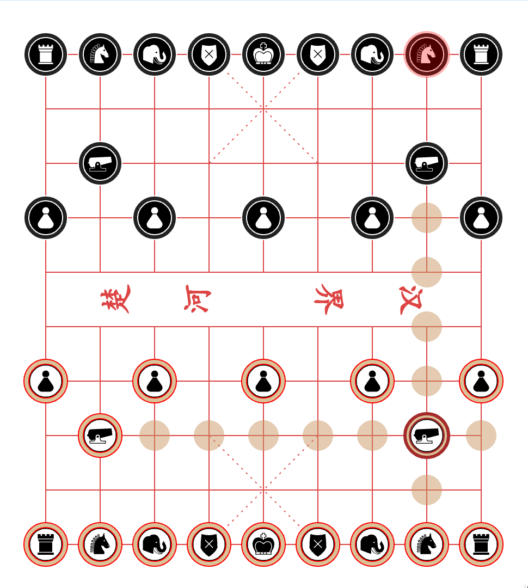

### Xiang Qi

Xiang Qi (Chinese Chess) is one of the most popular strategy board game in China. This project is built on  [ReactJS](https://facebook.github.io/react/) framework, SVG graphics and uses Javascript for computing the AI algorithm. The AI uses `Alpha Beta Pruning` to compute the most advantageous move as the black player, computation is done in the browser.

For a preview: [https://xiangqi-19724.herokuapp.com/](https://xiangqi-19724.herokuapp.com/)

The application is assembled in [Webpack](https://webpack.github.io/)

> npm run start

